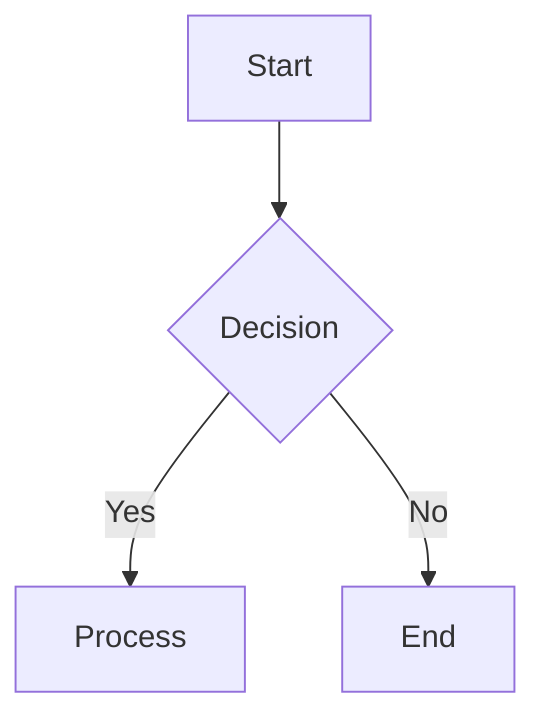
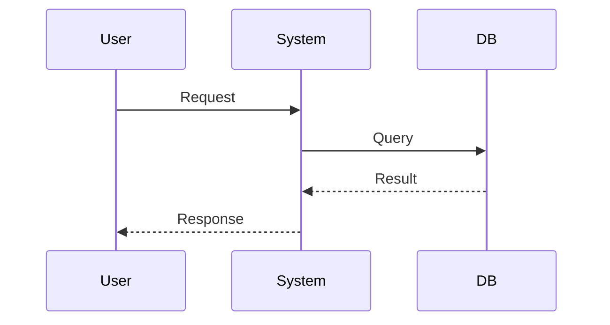

# System Design Template

## 1. Overview
*Describe the module's purpose and responsibility.*

## 2. Invariants & Guarantees
*What must ALWAYS be true? (e.g., "Balance can never be negative", "User must be authenticated")*
- Invariant 1:
- Invariant 2:

## 3. Failure Modes
*How can this fail? (e.g., Network partition, Database timeout)*
- Failure Mode 1:
- Failure Mode 2:

## 4. Architecture Diagrams (Mermaid)

### Flowchart

### Sequence Diagram

